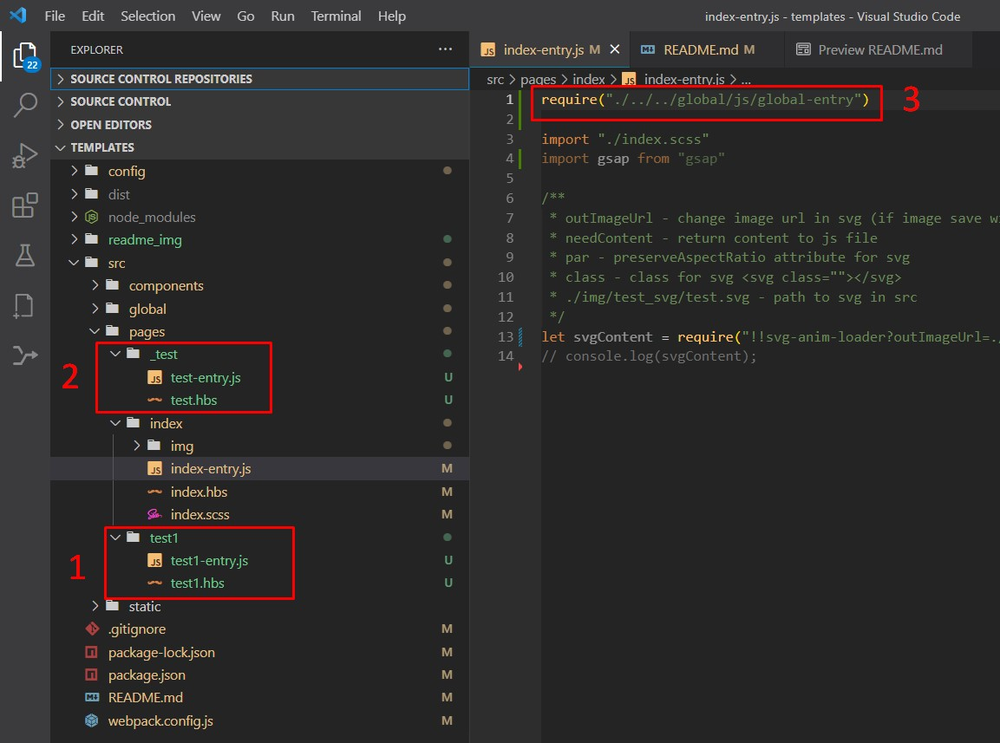

<h1 align="center"> Hello everyone!) </h1>

    

        <h3>Adding pages is now automatic.</h3>
        <ul>
            <li>To add a new page, you need to create a new folder with "page_name", as well as two mandatory files in
                this
                folder:
                "page_name-entry.js" and "page_name.hbs".(pic.1 - 1)</li>
            <li>Also, in order not to add a page to the build, you need to put _ : "_page_name" before the folder
                name.(pic.1
                - 2)</li>
            <li>Also, now to include global scripts and styles, you need to add them to "page_name-entry.js".(pic.1 - 3)
            </li>
        </ul>
    

    

        
        
pic.1

    

